# vue3-ts-cms

**客户端前台**: [cms-client_uniapp](https://github.com/deng-cl/cms-client_uniapp)

**Node后端接口**: [cms-node_koa](https://github.com/deng-cl/cms-node_koa)

下面是该项目中部分页面的截图

## 项目截图

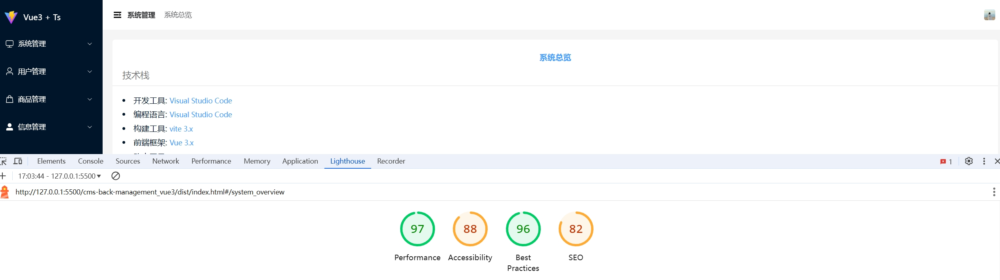

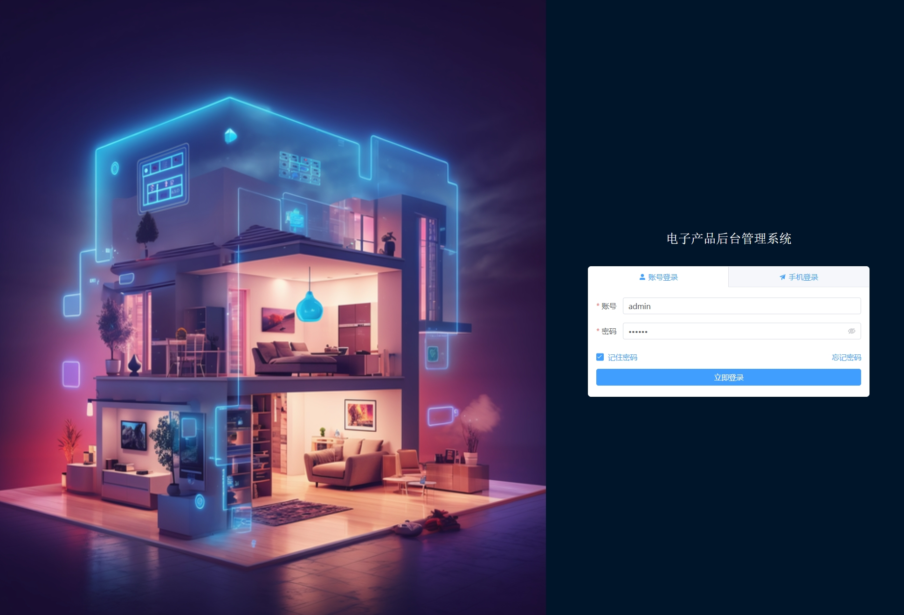

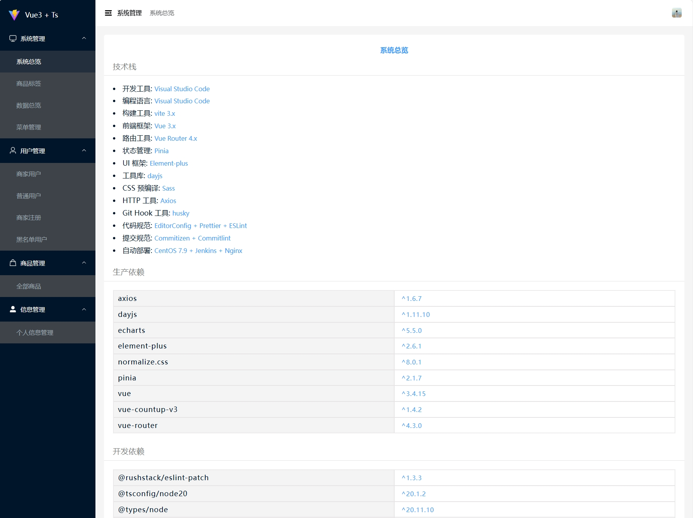

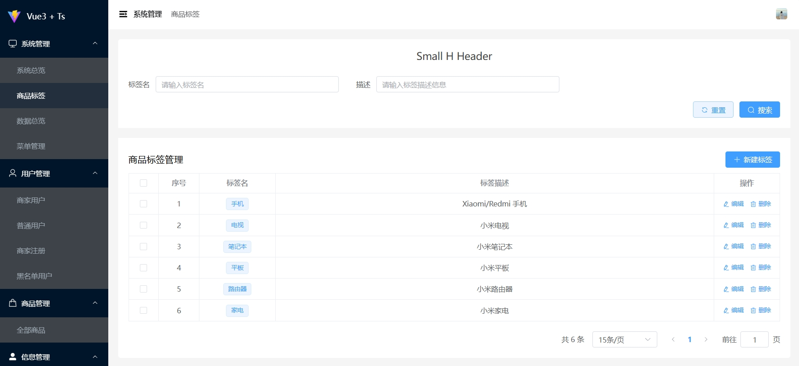

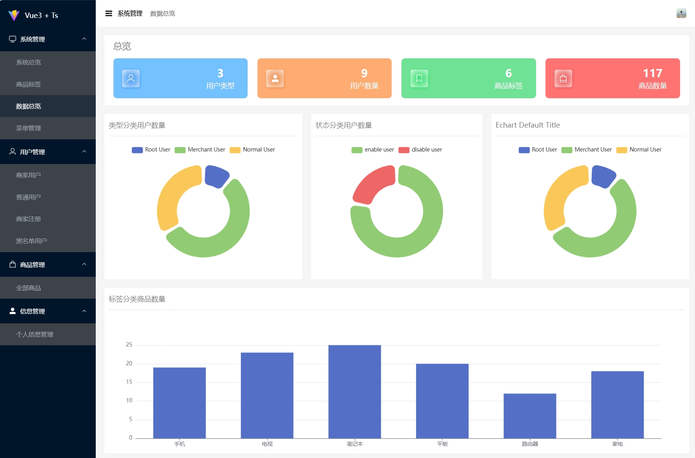

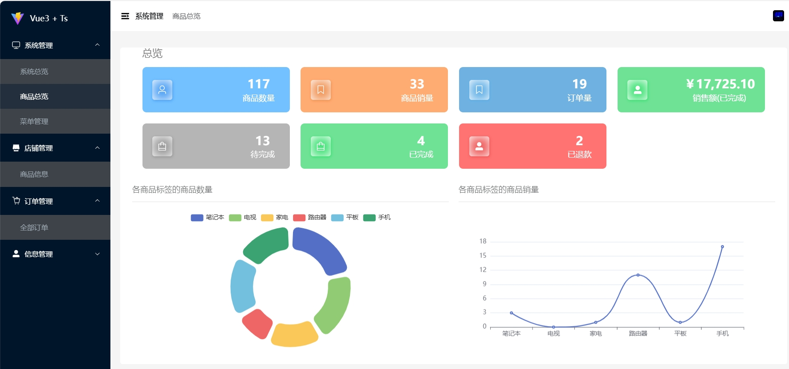

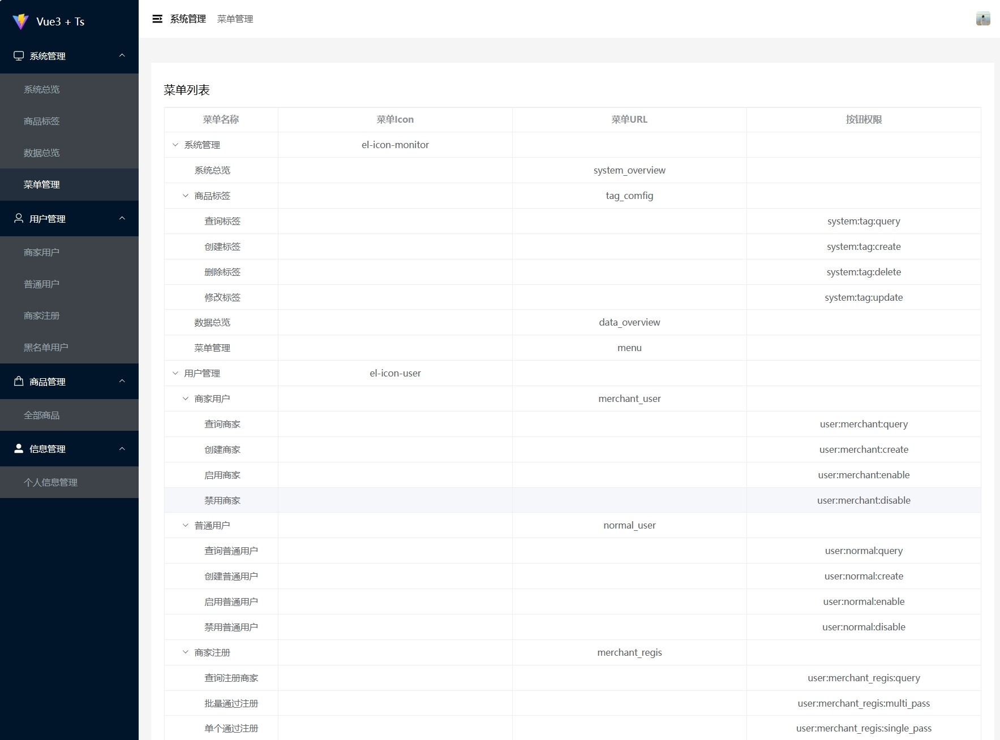

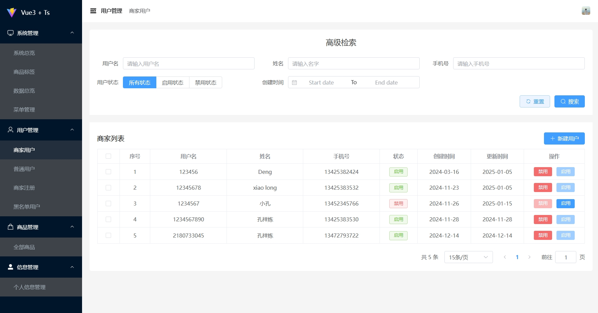

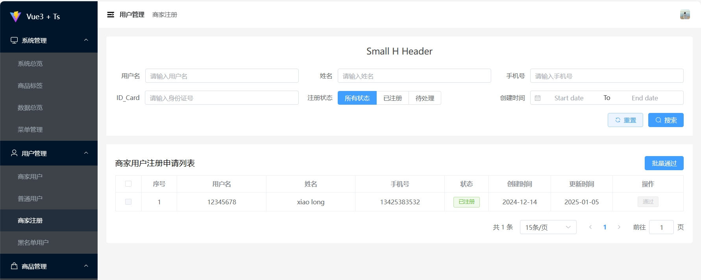

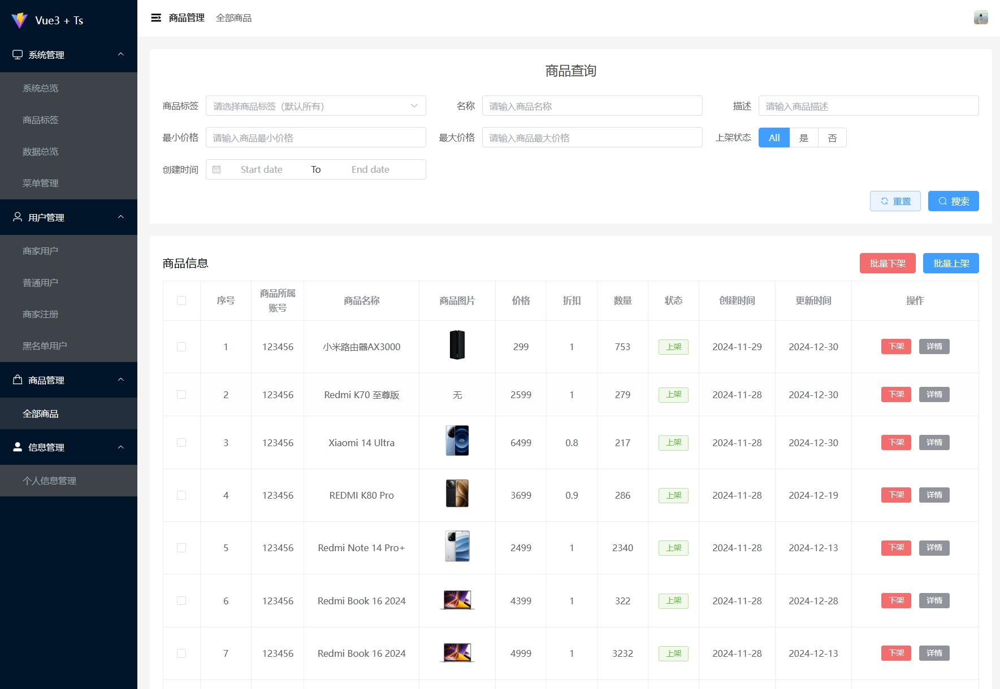

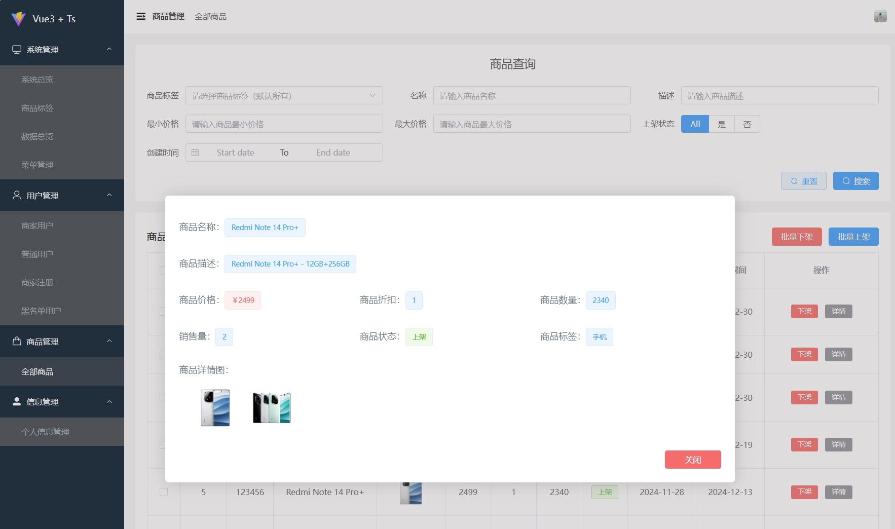

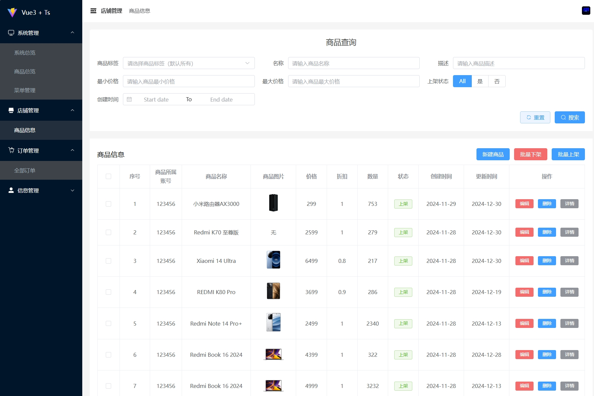

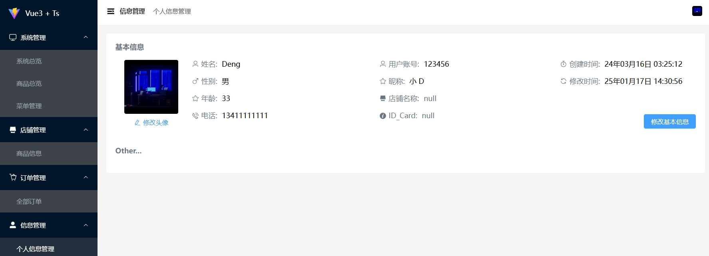

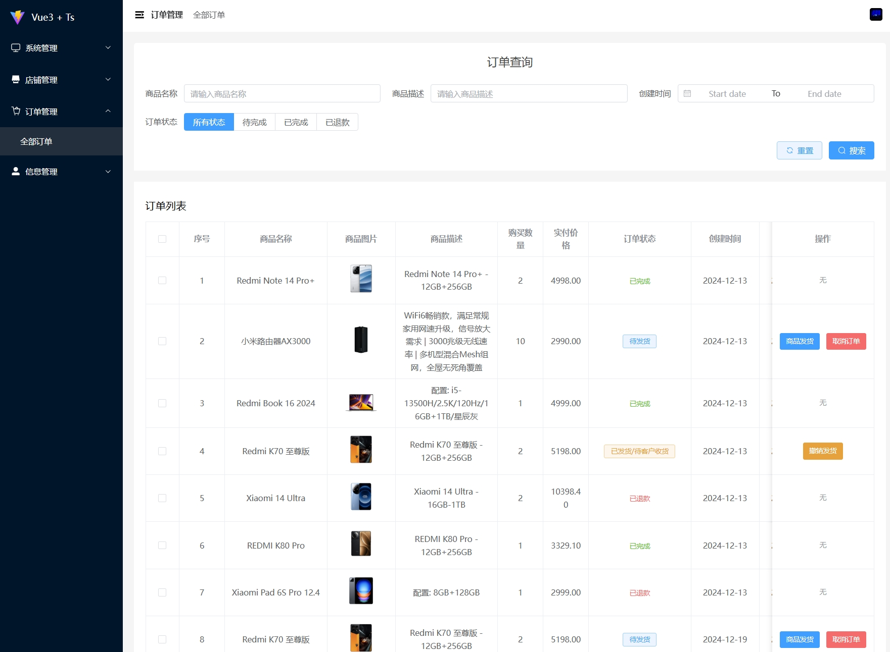

